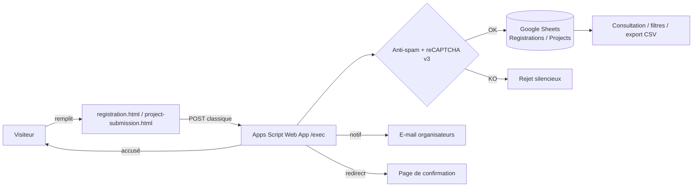
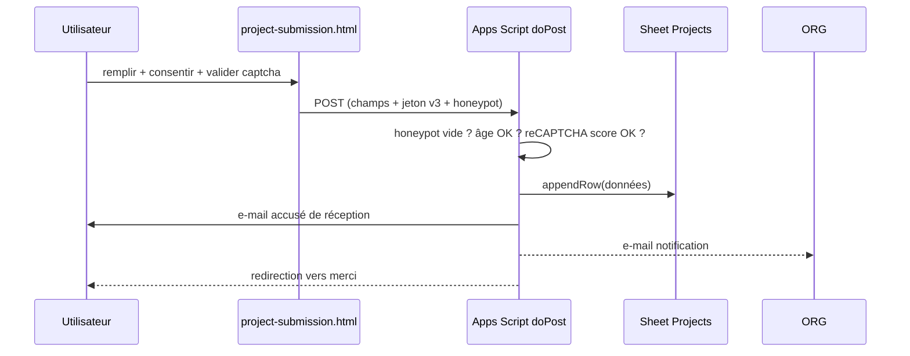
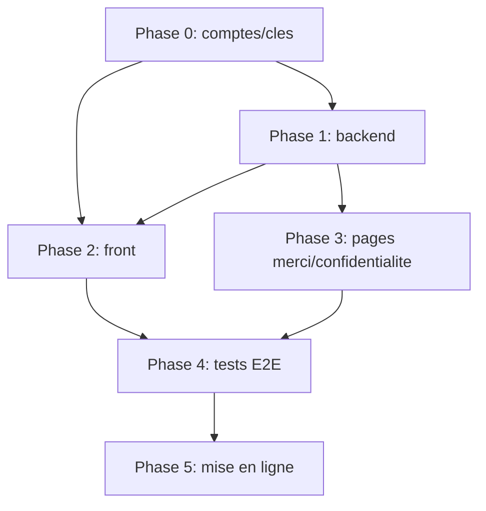

# Plan — Collecte des données des formulaires (Registration & Project submission)

> Statut : **backend Google déployé et frontend configuré**.
> Les recettes réelles d'**inscription** et de **projet** sur le domaine de production sont réussies (ligne Sheets + 2 statuts `sent` + redirection). Recette projet : soumission acceptée avec jeton reCAPTCHA v3 valide, redirection `thankyou.html?type=project`, chemins de sécurité vérifiés (jeton absent, honeypot, `submission_id` invalide).
> Restent à effectuer : confirmation de la ligne dans Projects et de la réception des e-mails, retrait de `localhost` de la configuration reCAPTCHA/`ALLOWED_HOSTNAMES`, et validation RGPD, avant ouverture durable.

## 1. Définition du projet

Rendre opérationnels les deux formulaires statiques du site pour que chaque soumission soit
**validée, stockée, notifiée et confirmée**, sans backend propriétaire, via
**Google Sheets + Apps Script** (gratuit), avec **reCAPTCHA v3 + honeypot** et
**consentement RGPD** obligatoire.

## 2. Exigences

### Fonctionnelles
- **F1** — Soumission valide → ligne ajoutée dans le bon classeur (Registrations ou Projects).
- **F2** — E-mail de notification vers les organisateurs.
- **F3** — E-mail d'accusé de réception bilingue EN/ES vers la personne.
- **F4** — Redirection vers une page de confirmation.
- **F5** — Google Sheets consultable/filtrable (dashboard de fait).
- **F6** — Honeypot + reCAPTCHA v3 + ancienneté du formulaire rejettent les robots.
- **F7** — Case de consentement RGPD obligatoire + lien politique de confidentialité bilingue.
- **F8** — Validation client : champs requis, email valide.

### Non fonctionnelles
- **N1** — 100 % gratuit (GitHub Pages inchangé, offres gratuites Google).
- **N2** — Aucun secret exposé (secret reCAPTCHA dans *Script Properties* ; site key publique).
- **N3** — Résistant au spam et réversible (retour à l'état « fermé » possible).
- **N4** — Bilingue EN/ES cohérent.
- **N5** — Conforme RGPD (information, rétention, sous-traitants Google).
- **N6** — Maintenance simple (Sheet + éditeur Apps Script).

## 3. Décisions

**Confirmées**
- Réception : **Google Sheets + Apps Script**.
- Compte : **Gmail gratuit dédié** (propriétaire des classeurs et du script).
- Stockage : **2 classeurs séparés** (Registrations, Projects).
- Anti-spam : **honeypot + reCAPTCHA v3**.
- RGPD : **case de consentement obligatoire + page de confidentialité bilingue**.
- Destination : notifications organisateurs + accusé de réception + tableau consultable.
- Script : **1 projet Apps Script partagé** (routage via `form_type`).
- Budget : **gratuit uniquement**.

**À valider avant ouverture**
- Le texte bilingue de la politique de confidentialité et du consentement.
- La durée de conservation proposée : **12 mois après BrainHack Donostia 2026**.
- Les tests réels Google Sheets, reCAPTCHA et e-mails après déploiement.

## 4. Architecture

### Composants et responsabilités

| Composant | Rôle |
|---|---|
| `registration.html` / `project-submission.html` | Champs, honeypot, consentement, chargement reCAPTCHA v3, injection du jeton, soumission |
| `privacy.html` | Politique de confidentialité bilingue, rétention, droits |
| `thankyou.html` | Confirmation bilingue, différenciée par `?type=registration\|project` |
| Apps Script Web App (`doPost`) | Parse `form_type`, honeypot/âge, vérifie reCAPTCHA v3, écrit la ligne, envoie les 2 e-mails, redirige |
| Classeur *Registrations* | Colonnes = champs du formulaire d'inscription |
| Classeur *Projects* | Colonnes = champs du formulaire de projet |
| *Script Properties* | `RECAPTCHA_SECRET`, IDs des 2 classeurs, e-mails destinataires |

Le backend vérifie aussi les valeurs autorisées, neutralise les formules de tableur,
utilise `submission_id` pour rendre l'écriture idempotente et conserve séparément
l'état des deux e-mails. Un déclencheur horaire optionnel sur `retryPendingEmails`
reprend uniquement les messages échoués.

### Flux de données (formulaire projet)

### Parcours utilisateur
1. Ouvre le formulaire → coche le consentement → remplit → clic.
2. Validation client (requis, consentement).
3. reCAPTCHA v3 s'exécute en arrière-plan, jeton inséré.
4. POST → traitement serveur → écriture + e-mails → redirection page de confirmation.

## 5. Feuille de route

### Phase 0 — Préparation (aucun code)

| # | Étape | Objectif | Prérequis | Résultat attendu | Vérification |
|---|---|---|---|---|---|
| 0.1 | Créer le Gmail dédié | Compte propriétaire | Accès | Compte Google fonctionnel | Connexion OK |
| 0.2 | Créer les 2 classeurs | Stockage | 0.1 | 2 Sheets vides, IDs notés | Ouvrir par URL |
| 0.3 | Créer les clés reCAPTCHA v3 | Anti-spam | 0.1 | Site key + secret, domaines prod + localhost | Console reCAPTCHA |
| 0.4 | Fixer rétention + texte de consentement | RGPD | — | Texte EN/ES validé | Relecture organisateurs |

### Phase 1 — Backend Apps Script (test isolé)

| # | Étape | Objectif | Prérequis | Résultat attendu | Vérification |
|---|---|---|---|---|---|
| 1.1 | Projet Apps Script + Script Properties | Secrets & IDs | Phase 0 | Propriétés configurées | Éditeur renvoie les valeurs |
| 1.2 | `doPost` (routage `form_type`) | Traiter les soumissions | 1.1 | Données parsées | Logs Apps Script |
| 1.3 | Écriture dans le bon classeur | Stockage | 1.2 | Ligne ajoutée | Ligne visible |
| 1.4 | Vérif honeypot + âge | Anti-bot simple | 1.2 | Soumission bot rejetée | Test manuel |
| 1.5 | Vérif reCAPTCHA v3 (`siteverify`) | Anti-bot fort | 0.3, 1.2 | Score sous seuil rejeté | Test jeton valide/invalide |
| 1.6 | E-mail notification organisateurs | F2 | 1.3 | E-mail reçu | Boîte destinataire |
| 1.7 | E-mail accusé bilingue | F3 | 1.3 | E-mail reçu | Boîte de test |
| 1.8 | Déployer Web App (« Anyone ») | URL `/exec` | 1.1–1.7 | URL de déploiement | Noter l'URL |

### Phase 2 — Intégration front

| # | Étape | Objectif | Prérequis | Résultat attendu | Vérification |
|---|---|---|---|---|---|
| 2.1 | Champ honeypot masqué | Anti-spam | — | Invisible, jamais rempli par un humain | Inspection DOM |
| 2.2 | Horodatage caché | Anti-bot | — | Champ temps rempli en JS | Inspecter la requête |
| 2.3 | Case consentement RGPD + lien | F7 | 0.4 | Bloqué si non cochée | Clic sans cocher → bloqué |
| 2.4 | Intégration reCAPTCHA v3 | F6 | 0.3 | Jeton injecté avant POST | Console réseau |
| 2.5 | Brancher `action` = URL `/exec` | F1 | 1.8 | POST effectif | Ligne créée |
| 2.6 | Ajuster le JS de garde | F8 | 2.5 | Validation requise conservée | Soumission valide passe |

### Phase 3 — Confirmation & information

| # | Étape | Objectif | Prérequis | Résultat attendu | Vérification |
|---|---|---|---|---|---|
| 3.1 | Créer `privacy.html` bilingue | RGPD | 0.4 | Page accessible | Lien depuis formulaires |
| 3.2 | Refondre `thankyou.html` (`?type=`) | F4 | — | Message adapté | Ouvrir les 2 variantes |

### Phase 4 — Tests de bout en bout

| # | Étape | Objectif | Prérequis | Résultat attendu | Vérification |
|---|---|---|---|---|---|
| 4.1 | Cas nominal ×2 formulaires | F1–F4 | Phases 1–3 | Ligne + 2 e-mails + redirection | Checklist manuelle |
| 4.2 | Honeypot rempli | F6 | 4.1 | Aucune écriture | Sheet inchangé |
| 4.3 | reCAPTCHA score bas / absent | F6 | 4.1 | Rejet | Log |
| 4.4 | Consentement absent | F7 | 4.1 | Bloqué client | Message |
| 4.5 | Champs manquants / email invalide | F8 | 4.1 | Bloqué client | Message |
| 4.6 | Accessibilité & mobile | N4 | 4.1 | Navigation clavier OK | Test mobile/clavier |
| 4.7 | `jekyll build` + revue `_site/` | Cohérence | Phases 2–3 | `_site/` à jour | `git status` |

### Phase 5 — Mise en ligne

| # | Étape | Objectif | Prérequis | Résultat attendu | Vérification |
|---|---|---|---|---|---|
| 5.1 | Retirer `disabled` + encarts « not open yet » | Ouverture | Phase 4 | Boutons actifs | Clic → envoi |
| 5.2 | Déclarer les domaines reCAPTCHA (prod) | F6 | 0.3 | Domaine prod autorisé | Pas d'erreur captcha |
| 5.3 | Commit branche d'année → PR → `master` | Déploiement | 5.1 | Site en prod | URL publique |
| 5.4 | Surveiller quota e-mails + volume | Fiabilité | 5.3 | Volume sous quota | Voir risques |

## 6. Dépendances

## 7. Risques et mesures préventives

| Risque | Impact | Mesure |
|---|---|---|
| Quota Gmail gratuit ≈ 100 e-mails/jour (2/soumission ≈ 50 inscriptions/jour) | E-mails perdus en pic | Digest quotidien des notifications, 1 e-mail/inscription + accusé, surveillance ; bascule Workspace si pic |
| Secret reCAPTCHA exposé | Spam | Secret uniquement dans *Script Properties* |
| CORS / POST bloqué | Formulaires non fonctionnels | POST classique + redirection serveur |
| Bot passe malgré tout | Données polluées | Seuil de score + honeypot + âge + modération |
| RGPD non conforme (EU) | Risque juridique | Consentement, page confidentialité, rétention, sous-traitant documenté |
| Dépendance à une personne (bus factor) | Maintenance bloquée | Documenter IDs/procédures dans `docs/contexte.md` |
| `_site/` non régénéré | Divergence prod/sources | `jekyll build` avant commit |
| Rejeu avant ouverture | Fuite de données | Ne pas retirer `disabled` avant Phase 5 |

## 8. Critères d'acceptation

- [x] Inscription valide → ligne dans *Registrations* + e-mail organisateurs + accusé + confirmation.
- [x] Idem pour *Projects* (recette projet réussie ; confirmation visuelle de la ligne dans le classeur à faire).
- [x] Honeypot / reCAPTCHA insuffisant / consentement absent → aucune donnée écrite (vérifié : jeton absent → erreur, honeypot → rejet silencieux ; consentement absent et envoi trop rapide non retestés).
- [x] Formulaire utilisable au clavier et sur mobile, libellés EN/ES.
- [x] Aucun secret dans le code public ; `privacy.html` accessible.
- [x] Retour à l'état fermé possible en re-désactivant les boutons.

## 9. Complexité relative

| Bloc | Complexité |
|---|---|
| Apps Script `doPost` + Sheets + e-mails | Moyenne |
| reCAPTCHA v3 (client + vérif serveur) | Moyenne |
| Modifs front (honeypot, consentement, garde JS) | Faible |
| Page confidentialité + page merci | Faible |
| Tests E2E & RGPD | Moyenne |

Aucune étape ne nécessite de payer ni de toucher à l'architecture Jekyll/GitHub Pages.
